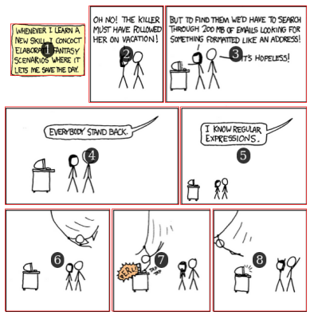

# Introduction

> Kumiko mascot by Cthulhulumaid, [CC-BY-SA 4.0](http://creativecommons.org/licenses/by-sa/4.0/ "Creative Commons License")

*Kumiko, the Comics Cutter* is a set of tools to compute useful information about comic book pages, panels, and more.
Its main strength is to find out the **locations of panels** within a comic's page (image file).
*Kumiko* can also compile information about panels for all pages in a comic book, and present it as one piece of data (JSON-formatted object).

*Kumiko* makes use of the great (freely licensed) [opencv](https://opencv.org/) library, which provides image processing algorithms of all sorts.
Mainly, the contour detection algorithm is used to detect panels within an image.

# Demo

*TL;WR* Too Long; Won't Read the whole doc?

Try reading [an *xkcd* episode](xkcd.html) panel by panel. :)

# Philosophy

*Kumiko* aims at being a functional library to extract information from comic pages / books.
The goal is to provide a set of tools that is usable beforehand, to extract all needed information.

External programs can later use the generated information for different purposes: panel-by-panel viewing, actual splitting of an image down into panels, etc.

## Panel-by-panel comic reading

Being able to jump from one panel to the next was the original idea behind *Kumiko*.

> [xkcd](https://www.xkcd.com) by Randall Munroe, [#208](https://www.xkcd.com/208/), [CC BY-NC 2.5](https://creativecommons.org/licenses/by-nc/2.5/)

Comic viewers usually imply a very common *page-by-page reading paradigm*.
You read a page, possibly zooming on it to be able to read speech bubbles, then click, tap, press a key or swipe to go to the next page.

With knowledge about panels locations, we can imagine a comic reader that also offers *panel-by-panel reading*.
This is especially interesting for **small screens**, on which you probably can't read the texts if a whole page is displayed.

We provide an example implementation of such an reader application.
Read more in the [example Reader documentation](doc/Reader.md).

# Requirements

`apt-get install python-opencv` will install the only necessary library needed: *opencv* (2.x).

This should do the trick for Debian distros and derivatives (Ubuntu, Linux Mint...).
If you successfully use *Kumiko* on any other platform, please let us know!

From memory (TODO: check), this implies using python version 2.x, since *opencv* 3.x runs on python 3.x.

# Usage

See the [usage doc](doc/Usage.md) for details on how to use the *Kumiko* tools.

# Numbering

The numbering is left to right, top to bottom for now (see roadmap).

Here is an example of how *Kumiko* is going to number panels by default (numbers and red lines not in the original picture).

> [Pepper & Carott](https://www.peppercarrot.com/) by [David Revoy](https://www.davidrevoy.com), [episode 2](https://www.peppercarrot.com/en/article237/episode-2-rainbow-potions), [CC BY 4.0](https://creativecommons.org/licenses/by/4.0/)

# Limitations

For now, *Kumiko* only deals with **white-ish backgrounds**.
Panels within a comic page will be any "object" that has non-white boundaries (not necessarily vertical or horizontal lines).

If you have ideas on how to programmatically guess the background color of a page, please let us know!

# Short- and longer-term awesome features (roadmap)

## Kumiko library

* be able to detect panel contours on pages with **non-white background**
	* implies being able to determine the background color: histogram, probing of some kind? (worst case: manually?)
* provide an option for **right-to-left numbering**, critical e.g. for mangas

## Back-office (validation / edition tool)

Let's face it: we probably can't ensure that *Kumiko* can perfectly find out the panels in *any* image.
There is a huge diversity of panel boundaries, layouts and whatnot.

This is why we should have some kind of back-office / editing tool that lets a human editor:

* validate pages
* add, delete, move or resize incorrect panels
* report bugs
* ...

Such a tool should edit the JSON file representing a comic book information, for later use by other programs that'll rely on it.
